<h1 align="center">Hi 👋, I'm Ajay Kumar</h1>

<h3 align="center">
🎓 BCA Student | 💻 Aspiring Full Stack Developer | 🇯🇵 Japan Aspirant
</h3>

  

  🌱 Currently learning Full Stack Development, DSA, Git & GitHub  
  📚 Pursuing Bachelor of Computer Applications (BCA)  
  🇯🇵 Preparing for opportunities in Japan  
  🚀 Working towards becoming a Software Engineer

## 🛠️ Technologies & Tools

  

## 📊 GitHub Stats

   

## 🚀 Projects

- 🚗 [Car Showcase Website](https://github.com/ajey-2003/bca-html-css-project) – Multi-page website built using HTML and CSS
- 🛒 [Amazon Clone](https://github.com/ajey-2003/amazon-clone) – Responsive Amazon homepage clone built with HTML & CSS featuring modern UI layout and product sections.
- [My Portfolio]("https://ajey-2003.github.io/ajay-kumar-portfolio") - Personal portfolio website showcasing my skills, projects, and journey.
- [AVICORE-X1](https://ajey-2003.github.io/AVICORE-X1) - Premium laptop landing page built with HTML, CSS, and JavaScript, featuring a modern responsive design.
## 🎯 Current Goals

- 🌱 Learning Full Stack Web Development
- 💻 Starting my Programming Journey
- 📚 Pursuing Bachelor of Computer Applications (BCA)
- 🇯🇵 Learning Japanese Language
- 🚀 Working towards becoming a Software Engineer
## 👀 Profile Views

  

